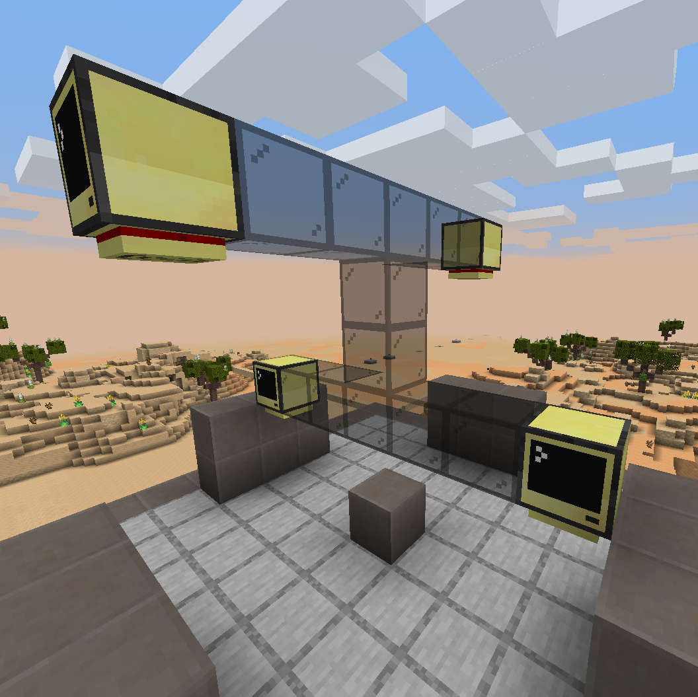
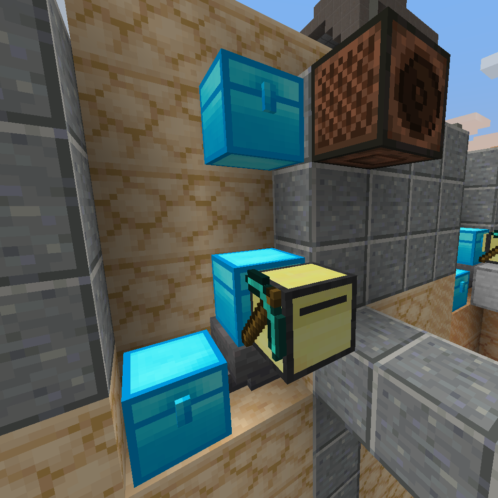

## Solo Heavy Robotic Intelligent Mechanical Prospector - better known as SHRIMP Bot
A ComputerCraft Mining Turtle Script

So uh, I wrote this very basic lua script that allows a mining turtle [ComputerCraft: Turtle](https://www.computercraft.info/wiki/Turtle) to mine a specified grid of blocks.
It was mainly done for two reasons: 
First, I wanted to learn a bit more Lua.
Second, scripting little bots, even in a game, is more fun than I originally would have thought.

Additional note: The version of the mod I'm using is [CC: Tweaked v. 1.95.2](https://github.com/SquidDev-CC/CC-Tweaked) in [Valhelsia 3 v. 3.1.9 - MC v. 1.16.5](https://github.com/ValhelsiaTeam/Valhelsia/releases/tag/3.1.9)

*Also I'm pretty sure a mining script for these bots already exists, but it's a nice challenge either way.*
## Current Features
  - ### Auto Determines North
  - ### Auto Empties At Designated Chest When Full
    The Chest, currently, has to be right at the location of where the bot started it's mining. 
  - ### Auto Refuels (Sort of)
    Also with a designated fuel depot location (Just a chest two blocks above the home depositing chest)
    At the moment it does not go to the refueling depot when low on fuel, it mainly relies 
  - ### Notifies When Fuel Depot is empty
    Using a designated Speaker Cube location (next to the fuel depot chest), the turtle emits redstone causing the speaker cube to fire off it's custom message.
    *I'm planning on fazing this out with the Mobile Alert feature, that or only using the speaker cube for special use cases.*
  - ### Coordinate to Coordinate Navigation

## Planned Features
  - ### Custom Chest Depositing Locations
    Simply input the coordinates of the chest before starting mining and the bot will make it's way to the chest when full
  - ### Mobile Alerts - For the [Advanced Pocket Computer](https://www.computercraft.info/wiki/Pocket_Computer)
    Whenever there's an issue with the bot, it will notifiy the designated APC's of it's status. I.e. low on fuel, job status, location, is finished, etc.
  - ### Ignore Certain Blocks
    You can specify a list of blocks to ignore and the turtle will either go around the blocks or notify using mobile alert and wait for input.
    I had this in mind because I would prefer the turtle to ignore mining Diamonds, best if I go and mine them with a pickaxe that has Fortune IV to get more out of one block of ore.
  - ### Figure Out a Better Bot Name..
  - ### Allow for more customization
  - ### Faze out the use of constant variables for X Y and Z
    Preferably I have the computer write to a config file on first startup so that the values are persistent between running different mining ops.
  - ### Position persistence
    If the bot is unloaded from a chunk I wan the bot to resume where it left off in the script, I think I have a way to make this possible.
  - ### More efficient mining
    The bot will continue to mine if it sees that it has room for a specific block, even if all the spaces are taken up but not full.
    Essentially even if the inventory has no more free spaces for *new* blocks, it will continue to mine and pick up blocks until it either reaches a full stack of 64 or detects a block it can't have in it's inventory and head to deposit the ore.


## Planned Fixes
  - ### How height is currently doubled
    It's a simple fix of changing a 2 to a 1 in the digDown() function
    I haven't changed it as I want to experiment and test speeds of mining.
    I believe that the bot, if it were to mine the block above, infront, and below, then move, would be much faster than mining infront, move, mining infront, etc.
    
    I have yet to test this but for the time being that means that the digging height is doubled and any odd numbered height values will mine one extra block.

### Possible issues one may come across
  - Lack of persistence, meaning if there's nothing loading the chunck the bot is mining in, it will stop mining and cease execution of the script.
    ###### Fix: Replace the bot at the home block and restart the script.
  - Not placing chests in the right areas: please don't do that to the poor bots, they'll forever be looking for that chest.. :(
    ###### Fix: See setup for how to place the chests!
  
  Not gonna lie, I'm very interested to see how people break my bot script.

## Setup
  1. ### Setup the GPS Host PC's **IT'S _VERY_ IMPORTANT YOU DO THIS**
    The Turtle requires a GPS connection to locate it's position in the world, which is then used to navigate to other coordinates.

    Here's the [original instructions](https://wiki.computercraft.cc/GPS_Hosts) I used to build my GPS station.
    
    Their example for a setup:
    
    *Src is the wiki link above*
    
    My Example:
    
    
    After you have setup the cluster, on each computer you'll have to edit the startup script. On each host computer, 
    1. edit startup.lua
    2. paste ```shell.run "gps host <x coordinate> <y coordinate> <z coordinate>"``` and replace the X Y Z coordinates with the **_Exact_** coordinate of the computer you're editing the startup file.
      ```Ex: shell.run "gps host 140 77 -1386"```
      *PS: When looking at the computer block, press F3, check the top right for "Targeted Block" and use those coordinates. The coordinates will be different for each computer!*
  2. ### Find a location to setup your Diggy Boi (Still not 100% on that name..)
    Setup it's starting location with the necessary chests and speaker blocks.
    The bot digs in a "Clockwise" motion, always starting from bottom left and ending at the top right. So you'll want to place the bot just like in the example below.
    Example of a 3x3 digging area:

    S: Start block
    [ ][ ][ ]
    [ ][ ][ ]
    [S][ ][ ]

    Then you'll add the chests in the proper area **_behind_** where the bot starting. I'm using a hopper under the chest as I know even with a large chest, it will get full very quickly.
    Then refueling depot (chest) will be placed 1 block above the deposit chest (Make sure to fill it with plenty of fuel! Any burnable fuel source will work.), with the speaker block being to the **_right_** of the chest but on the same axis as the bot. (Difficult to explain easily, see image for a complete idea of the layout)
    

  3. ### Start the bot, edit, and then run the script
    First you'll want to edit the scripts grid variables, here's an example to help.
    Also when you're editing the height value, remember it doubles. So a height of 4 will mean the bot digs 8 blocks down, I do plan to fix this.
      Y  Y  Y
    X[ ][ ][ ]
    X[ ][ ][ ]
    X[S][ ][ ]

    local column = 5  -- Y
    local row = 5     -- X
    local height = 20 -- Z - A height of 10 means the bot will dig 20 blocks down.

    Setting up the column and row this way in the script was done on purpose. I wanted the values to be persistent through picking up and placing the turtle so that you don't have to keep retyping in the X Y and Z values. This can be done using the file system and writing/ reading a config file but that's something for the future as it was simpler to use constant variables.

    Save and exit and then run the script.
    Once the script is running it will prompt when it figures out the direction it is facing. Then it will begin it's mining operation!


Extra links: Any information is useful! Especially the old stuff.
- [Old ComputerCraft Wiki](https://www.computercraft.info/)
- [ComputerCraft: Tweaked Wiki](https://tweaked.cc/)
- [Old CC: Tweaked Wiki](https://wiki.computercraft.cc/GPS_Hosts)
- [GPS Host Setup](https://wiki.computercraft.cc/GPS_Hosts)

#### Totally not a list of names for bots, clever names are difficult okay?
  - Diggy Boi 212
  - Tunneling Excavating Digging Bot                      - TED Bot
  - Personal Autonomous Mining Bot                        - PAM Bot, this is an option if you want a friend for your TED bot!
  ##### Figured I'd make some names for a friend who really likes Crabs, Frogs, and Shrimp.
  - Cave Removal Autonomous Bot                           - CRAB, scuttles around while digging :crab:!
  - Solo Harvesting Retrieval Mining Prospector           - SHRMP, he prefers solo missions. Mission's where he can secretly eat coal without the other bots seeing.
  - Solo Heavy Remote Intelligent Mechanical Prospector   - SHRIMP
  - Solo Heavy Robotic Intelligent Mechanical Prospector  - SHRIMP
  - Flying Removal Operator G                             - FROG, if only those little bots could jump.. Well, that's why we gave him the ability to float.
  - Prospecting Heavy Robot 0G                            - PHR0G, if only those little bots could jump.. Well, that's why we gave him the ability to float.
